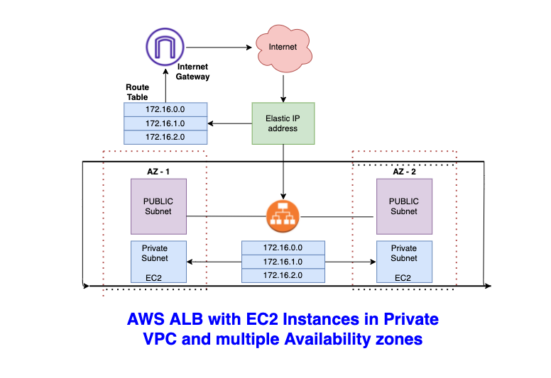

Setup AWS Credentials and Config
---------------
1. Install AWS command line interface from [here](https://aws.amazon.com/cli/)
2. Get the AWS Access Key ID and AWS Secret Access Key
   Naviate to your AWS Console -> User Profile -> Security Credentials -> Access Keys -> 
                        Create New Access Key -> Save Access Key ID and Secret Access Key.
3. Use its interactive configure command to set up your credentials and default region.
   Run `aws configure`

$ aws configure
```
AWS Access Key ID [None]: xxxxxxxxxxxxxxxx
AWS Secret Access Key [None]: xxxxxxxxxxxx/xxx/xxxxxxxxxxxxxxxxxxxx
Default region name [None]: us-east-2
Default output format [None]:
```

Create a venv 
---------------
$ python -m venv venv

Prerequisites 
----------------
$ pip3 install -r requirements.txt

Run the Script
-----------------
$ python createALBwithPrivateVPC.py

```
***** VPC Created with ID********* vpc-xxxxxxxxxx
Route Table 1 Created -  rtb-xxxxxxxxxx
Subnet 1 is Created with ID -  subnet-xxxxxxxxxx
Route table 1 associated with Subnet 1 - subnet-xxxxxxxxxx
Route Table 2 Created -  rtb-0xxxxxxxxxx
Subnet 2 is Created with ID -  subnet-xxxxxxxxxx
Route table 2 associated with Subnet 2 - subnet-xxxxxxxxxx
Subnet 3 is Created with ID -  subnet-xxxxxxxxxx
Route table 1 associated with Subnet 3 - subnet-xxxxxxxxxx
Subnet 4 is Created with ID -  subnet-xxxxxxxxxx
Route table 2 associated with Subnet 4 - subnet-xxxxxxxxxx
Created Security Group for Web Instances - sg-xxxxxxxxxx
Created Security Group for ELB - sg-xxxxxxxxxx
Launching web1 instance -  i-xxxxxxxxxx
Launching web2 instance -  i-xxxxxxxxxx
Successfully created load balancer -  arn:aws:elasticloadbalancing:us-east-1:xxxxxxxxxx:loadbalancer/app/elb/xxxxxxxxxx
Successfully created target group -  arn:aws:elasticloadbalancing:us-east-1:xxxxxxxxxx:targetgroup/tg/xxxxxxxxxx
```


WorkFlow Diagram
----------------


